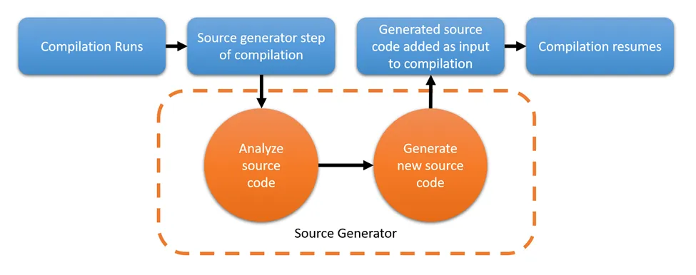

# Incremental Source Generator

# 소개

***TLDR: .NET의 소스 생성기를 사용하면 사용자 코드를 검사하고 해당 분석에 따라 즉석에서 추가 코드를 생성할 수 있습니다. 이 블로그 게시물의 예는 약간 중복되는 것처럼 보일 수 있지만, 더 고급 패턴을 사용하면 수백 줄의 코드를 생성하여 프로젝트 전체에서 보일러플레이트와 반복 코드를 줄이는 데 도움이 됩니다. 소스 생성기는 런타임 리플렉션 사용을 줄이는 데도 유용하며, 이는 비용이 많이 들고 애플리케이션 속도를 저하시킬 수 있습니다.***

**업데이트** : 소스 생성기가 .NET 표준을 타겟으로 해야 하는 이유를 업데이트했고 예제에서 중복된 일부 코드를 제거했습니다.

Microsoft에 따르면 " *소스 생성기는 컴파일 타임 메타프로그래밍, 즉 컴파일 타임에 생성되어 컴파일에 추가될 수 있는 코드를 가능하게 하는 것을 목표로 합니다. 소스 생성기는 실행하기 전에 컴파일의 내용을 읽고 추가 파일에 액세스할 수 있으므로 생성기는 사용자 C# 코드와 생성기별 파일을 모두 내성할 수 있습니다. 생성기는 기본 입력 소스에서 시작하여 생성하려는 출력에 매핑하는 파이프라인을 만듭니다. 노출되고 적절하게 동일화된 상태가 많을수록 컴파일러가 변경 사항을 더 일찍 잘라내고 동일한 출력을 재사용할 수 있습니다.*



 ******

# 소스생성기가 하지 말아야 할일

Microsoft는 생성기를 사용해서는 안 되는 영역으로 두 가지 주요 개념을 지적합니다. 첫 번째 영역은 언어 기능을 추가하는 것입니다. Microsoft는 다음과 같이 말합니다. " *소스 생성기는 새로운 언어 기능을 대체하도록 설계되지 않았습니다. 예를 들어, 레코드가 지정된 구문을 컴파일 가능한 C# 표현으로 변환하는 소스 생성기로 구현되는 것을 상상할 수 있습니다. 우리는 이것을 명백히 안티 패턴으로 간주합니다. 언어는 계속 발전하고 새로운 기능을 추가할 것이며, 소스 생성기가 이를 가능하게 하는 방법이 될 것으로 기대하지 않습니다. 그렇게 하면 생성기 없이 컴파일러와 호환되지 않는 C#의 새로운 '방언'이 생성됩니다.* "

이 점에 있어서 저는 .NET 개발자가 언어에 새로운 기능을 추가할 수 있도록 허용하면 기능 간 경쟁, 요구 사항 혼란, .NET 컴파일러와의 비호환성 문제가 발생할 가능성이 있다는 팀 의견에 동의합니다. 이는 오히려 개발자를 혼란스럽게 만들고 소스 생성기에서 멀어지게 할 뿐입니다.

두 번째는 코드 수정입니다. Microsoft 설명서에는 " *오늘날 사용자가 어셈블리에서 수행하는 후처리 작업이 많이 있는데, 여기서는 이를 '코드 재작성'으로 광범위하게 정의합니다. 여기에는 다음이 포함되지만 이에 국한되지는 않습니다.*

- *최적화*
- *로깅 주입*
- *IL 위빙*
- *콜 사이트 재작성*

*이러한 기술은 많은 귀중한 사용 사례가 있지만 소스 생성이라는 개념에 맞지 않습니다. 이는 정의상 소스 생성기의 제안에 의해 명시적으로 배제되는 코드 변경 작업입니다* .

기술적으로 정확하지만, 이는 대체를 수행할 "생성기"를 원하지 않는 팀에 대한 의미론적 한계선처럼 느껴지며, 액세스할 수 있는 언어 파괴 기능이 아닙니다. 그렇게 말하면서, 소스 생성기를 사용하는 목표의 일부라면 최근에 사용한 코드 재작성에 대한 해결 방법을 보여드리겠습니다.

소스 생성기는 분석기가 아닙니다. 종종 함께 사용되고 프로젝트에서 하나를 활용하기 위한 정확히 동일한 요구 사항을 많이 공유하지만, 생성기의 역할은 코드를 생성하는 것이고 분석기의 역할은 코드 포맷팅과 같은 다양한 규칙에 따라 경고나 오류를 생성하거나, 소스 생성기에서 볼 수 있듯이 분석기 작성자가 환영받지 못한다고 생각하는 특정 함수/코드 베이스에 대한 액세스를 차단하는 것입니다.

# **현대 .NET의 주요 소스 생성기 유형**

이 글을 쓰는 시점(2024년 9월)에 .NET 팀은 증분형 생성기를 선호하여 "ISourceGenerator"를 구현하는 소스 생성기를 더 이상 사용하지 않기로 결정했습니다. 이 변경 사항은 강제로 적용되어 Roslyn API 버전 4.10.0/.NET 9 이후 버전에서는 이전 "ISourceGenerator" API에 대한 액세스가 차단될 것으로 보입니다. ( [이전 생성기 사용 중단](https://github.com/dotnet/roslyn/blob/main/docs/features/source-generators.md#summary) ). 따라서 이 블로그 게시물 시리즈에서는 "IncrementalGenerator" 사용에 대해서만 다룹니다.

# 증분형 소스 생성기

증분형 생성기는 항목이 필터링 요구 사항을 통과한 후에만 평가 및 실행을 수행하는 소스 생성기로, 성능을 크게 향상시킵니다.

일반적으로 소스 생성기는 디자인 타임과 컴파일 타임에 실행하려고 합니다. 좋은 방법이기는 하지만, 프로젝트에서 무언가가 변경될 때마다(예: 코드 줄 삭제, 코드 줄 추가, 새 파일 만들기 등) 소스 생성기로 표시된 모든 클래스가 실행됩니다. 상상할 수 있듯이 입력할 때마다 무언가를 실행하는 것은 성능에 이상적이지 않습니다. 따라서 Microsoft는 이러한 증분 생성기를 만들어 성능 문제를 해결하는 데 도움을 주었습니다.

소스 생성기는 .을 대상으로 해야 합니다 `.NET standard 2.0`. 그 이유는 현재 .NET 컴파일러는 .NET standard 2.0을 대상으로 하고, 소스 생성기는 컴파일러가 로드한 어셈블리로, 컴파일러가 이해할 수 있는 버전을 대상으로 해야 하기 때문입니다. 이 섹션을 마치면 세 개의 프로젝트가 포함된 솔루션이 생깁니다.

- `A .NET standard 2.0 library (Source Generator)`
- `A .NET standard 2.0 library (A shared library for the generator and consumers)`
- `A .NET 8 web API project (Main project)`

터미널이나 선택한 IDE에서 명령을 사용하여 `dotnet`이러한 프로젝트를 만들 수 있습니다. IDE/플랫폼에 독립적이므로 dotnet 도구를 사용하겠습니다. 다음 명령은 필요한 프로젝트를 생성합니다.

1. `dotnet new sln -n IncrementalSourceGenPractice`
2. `dotnet new webapi -n WebProject — project .\IncrementalSourceGenPractice.sln`
3. `dotnet new classlib -f netstandard2.0 — langVersion 12 -n SourceGenerator — project .\IncrementalSourceGenPractice.sln`
4. `dotnet new classlib -f netstandard2.0 — langVersion 12 -n SourceGenerator.SharedLibrary — project .\IncrementalSourceGenPractice.sln`
5. `dotnet sln .\IncrementalSourceGenPractice.sln add .\SourceGenerator.SharedLibrary\SourceGenerator.SharedLibrary.csproj .\SourceGenerator\SourceGenerator.csproj .\WebProject\WebProject.csproj`

소스 생성기를 만들기 전에 몇 가지 Nuget 패키지를 추가하고 .csproj 파일을 변경해야 합니다. *SourceGenerator.csproj* 파일을 열고 다음 내용과 일치하는지 확인합니다.

```xml
<Project Sdk="Microsoft.NET.Sdk">

  <PropertyGroup>
    <TargetFramework>netstandard2.0</TargetFramework>
    <LangVersion>latest</LangVersion>
    <Nullable>enable</Nullable>
    <EnforceExtendedAnalyzerRules>true</EnforceExtendedAnalyzerRules>
    <IsRoslynComponent>true</IsRoslynComponent>
    <IncludeBuildOutput>false</IncludeBuildOutput>
  </PropertyGroup>

  <ItemGroup>
    <PackageReference Include="Microsoft.CodeAnalysis.Analyzers" Version="*">
      <PrivateAssets>all</PrivateAssets>
      <IncludeAssets>runtime; build; native; contentfiles; analyzers; buildtransitive</IncludeAssets>
    </PackageReference>
    <PackageReference Include="Microsoft.CodeAnalysis.CSharp" Version="*" />
    <PackageReference Include="PolySharp" Version="*">
      <PrivateAssets>all</PrivateAssets>
      <IncludeAssets>runtime; build; native; contentfiles; analyzers; buildtransitive</IncludeAssets>
    </PackageReference>
  </ItemGroup>

  <ItemGroup>
    <ProjectReference Include="..\SourceGenerator.SharedLibrary\SourceGenerator.SharedLibrary.csproj" OutputItemType="Analyzer" />
  </ItemGroup>

</Project>

```

*패키지 참조의 버전 번호는 다를 수 있지만 .NET standard 2.0 대상* 에 유효한 한 문제 없습니다 .

추가된 세 가지 구성 설정은 다음과 같습니다.

1.`<EnforceExtendedAnalyzerRules>true</EnforceExtendedAnalyzerRules>`

- 생성기가 .NET 팀에서 만든 권장 규칙을 사용하고 있는지 확인합니다.

2.`<IsRoslynComponent>true</IsRoslynComponent>`

- 프로젝트가 생성기 역할을 하고 Roslyn 컴파일러와 함께 작동하여 생성기 디버깅이 가능해집니다.

3.`<IncludeBuildOutput>false</IncludeBuildOutput>`

- 이렇게 하면 생성기가 컴파일 타임에만 실행되도록 되어 있기 때문에 프로젝트 빌드가 출력에 포함되지 않습니다.

*이 .csproj* 파일 의 또 다른 이상한 구성은 `OutputItemType=”Analyzer”`공유 라이브러리에 대한 프로젝트 참조에 추가된 것입니다. 공유 라이브러리가 분석기가 아니더라도 생성 중에 생성기가 액세스할 수 있도록 필요합니다.

마지막으로 필요한 구성은 *webproject.csproj* 파일에 대한 것입니다.

프로젝트에 다음 줄을 추가합니다.

```xml
< EmitCompilerGeneratedFiles > true </ EmitCompilerGeneratedFiles > 
< CompilerGeneratedFilesOutputPath > .\GeneratedFiles </ CompilerGeneratedFilesOutputPath >
```

- 이 두 가지 옵션을 사용하면 소스 생성기 파일을 파일 시스템에 쓰고, 기본 경로를 사용하는 대신 이를 쓸 사용자 지정 경로를 설정할 수 있습니다.

마지막으로 다음 항목 그룹도 *webproject.csproj* 파일에 추가합니다.

```xml
< ItemGroup > 
< ProjectReference  Include = "..\SourceGenerator.SharedLibrary\SourceGenerator.SharedLibrary.csproj" /> 
< ProjectReference  Include = "..\SourceGenerator\SourceGenerator.csproj"  ReferenceOutputAssembly = "false"  OutputItemType = "Analyzer" /> 
</ ItemGroup >
```

# 시작

# **생성을 위한 관련 대상 추가**

첫 번째 부분에서는 비교적 간단한 것을 생성할 것입니다. 하지만 이후 게시물에서는 소스 생성기를 사용하는 방법을 더 자세히 살펴보고, 이 블로그의 시작 부분에 설명된 목표를 달성하기 위한 작은 AOP 프레임워크를 생성할 것입니다.

*웹 프로젝트를* 열고 다음 소스를 사용하여 새 클래스를 추가합니다 .`Calculator.cs`

그런 다음 이 클래스에 대해 더하기, 빼기, 곱하기, 나누기 함수를 생성합니다. 기존 클래스에 콘텐츠만 추가한다는 의도된 기능을 고수하기 위해 클래스를 부분적이라고 표시해야 합니다. 이는 클래스의 소스 코드 중 더 많은 부분이 다른 파일에 있을 수 있음을 나타냅니다.

# **증분 소스 생성기 시작**

축하합니다. 마침내 필요한 설정을 마쳤습니다.

마지막으로, 해당 구성이 완료되면 소스 생성기를 작성하기 시작할 수 있습니다. *SourceGenerator*`CalculatorGenerator` **프로젝트에서 다음 내용으로 명명된 클래스를 추가합니다 .

이것은 뼈대만 있는 시작점을 제공합니다. 유효한 증분 소스 생성기가 되려면 클래스는 `IIncrementalGenerator`에서 상속받아야 하며 `[Generator]`속성으로 장식되어야 합니다. 인터페이스는 생성기가 `Initialize` 함수만 구현하도록 요구합니다.

```csharp

public partial class Calculator
{
  public int num1 { get; set; }
  public int num2 { get; set; }
}
```

```csharp
using System;
using Microsoft.CodeAnalysis;

namespace SourceGenerator;

[Generator]
public class CalculatorGenerator : IIncrementalGenerator
{
  public void Initialize(IncrementalGeneratorInitializationContext context)
  {
 
  }
}
```

## **제공자**

`IncrementalGeneratorInitializationContext`이 메서드에서 제공하는 인수는 기본 `Initialize`소스에 대한 액세스를 제공합니다.

컨텍스트 객체는 여러 가지 다른 "공급자"를 통해 이를 수행합니다.


- `*CompilationProvider*`
    - > 전체 컴파일과 관련된 데이터(어셈블리, 모든 소스 파일, 다양한 솔루션 전체 옵션 및 구성)에 액세스할 수 있습니다.
- `*SyntaxProvider*`
    - > 향후 작업을 위해 노드를 분석, 변환 및 선택하기 위한 구문 트리에 액세스(가장 일반적으로 액세스됨)
- `*ParseOptionProvider*`
    - > 언어, 일반 코드 파일, 스크립트 파일, 사용자 정의 전처리기 이름 등, 구문 분석되는 코드에 대한 다양한 정보에 액세스할 수 있습니다.
- `*AdditionalTextsProvider*`
    - > 추가 텍스트는 다양한 사용자 정의 속성이 있는 JSON 파일과 같이 액세스하려는 소스가 아닌 모든 파일입니다.
- `*MetadataReferencesProvider*`
    - > 전체 어셈블리 항목을 직접 가져오지 않고도 어셈블리와 같은 다양한 항목에 대한 참조를 가져올 수 있습니다.
- `*AnalyzerConfigOptionsProvider*`
    - > 소스 파일에 추가 분석기 규칙이 적용된 경우 이를 통해 액세스할 수 있습니다.

우리가 신경쓰는 것은 `CompilationProvider`과 입니다 `SyntaxProvider`.

메서드 호출 에 접근합니다 `context.SyntaxProvider.CreateSyntaxProvider()`

메서드는 두 개의 인수를 사용합니다. 첫 번째는 로 불리는 `predicate`매우 가벼운 필터로, 코드베이스의 모든 것을 우리가 관심 있는 항목으로만 축소합니다. 두 번째는 로 불리는데 `transform`, 필터에서 우리가 관심 있는 것을 수집하고 나중에 작업하려는 객체를 반환하기 전에 원하는 대로 추가 변경, 속성 액세스, 추가 필터링 등을 수행합니다.

이 방법을 사용하는 예는 `syntaxProvider`다음과 같습니다.

인수의 이름(predicate, transform)은 제공할 필요가 없습니다. 어느 것이 어느 것인지 이해하기 쉽게 하기 위해 포함시켰습니다.

**업데이트** : 이 블로그 게시물의 이전 버전에는 가능한 null 결과를 제거하기 위한 `.Where()` 필터 호출이 포함되어 있었습니다. 그러나 이 경우 `ClassDeclarationSyntax` 객체는 결코 null이 아니므로 해당 코드 줄을 제거했습니다.

또한 이와 같이 구문 노드를 반환하는 것은 좋지 않다는 점에 유의해야 합니다. Roslyn은 대신 반환할 레코드 유형과 같은 것을 제공하면 캐싱을 활용할 수 있기 때문입니다. 이전에 반환된 노드와 미래에 반환하고 싶을 수 있는 노드를 비교하는 것이 더 간단합니다. 지금은 구문 노드를 사용하고 시리즈의 다음 부분에서는 몇 가지 최적화를 다룰 것입니다.

```csharp
using Microsoft.CodeAnalysis;
using Microsoft.CodeAnalysis.CSharp.Syntax;
using System;
using System.Collections.Generic;
using System.Runtime.InteropServices.ComTypes;
using System.Text;
using System.Threading;

[Generator]
public class GetGenerator : IIncrementalGenerator
{
    public void Initialize(IncrementalGeneratorInitializationContext context)
    {
        IncrementalValuesProvider<ClassDeclarationSyntax> calculatorProvider =
             context.SyntaxProvider.CreateSyntaxProvider(
                 //using Microsoft.CodeAnalysis;
using Microsoft.CodeAnalysis.CSharp.Syntax;
using System;
using System.Collections.Generic;
using System.Runtime.InteropServices.ComTypes;
using System.Text;
using System.Threading;

[Generator]
public class GetGenerator : IIncrementalGenerator
{
    public void Initialize(IncrementalGeneratorInitializationContext context)
    {
        IncrementalValuesProvider<ClassDeclarationSyntax> calculatorProvider =
             context.SyntaxProvider.CreateSyntaxProvider(
                 // predicate는 조건을 만족하는 노드를 필터링하는 함수입니다.
                 // SyntaxNode를 받아서 그 노드가 원하는 조건을 충족하는지 확인하고,
                 // **true 또는 false**를 반환합니다.
                 predicate: (SyntaxNode node, CancellationToken cancellationToken) =>
                 {
                     return node is ClassDeclarationSyntax classDeclaration &&
                     classDeclaration.Identifier.ToString() == "Calculator";
                 }, // 여기서 반환한 값이 True인경우 transform 실행  
                 transform: (GeneratorSyntaxContext syntaxContext, CancellationToken cancellation) =>
                 {
                     return (ClassDeclarationSyntax)syntaxContext.Node;
                 });

    }
} 
```

**Predicate와 Roslyn의 SyntaxNode 구조**:

- **SyntaxNode**는 Roslyn 컴파일러가 코드의 구조를 파악하기 위해 사용하는 노드입니다. 예를 들어, 클래스, 메서드, 구문 등으로 이루어진 계층적 트리 구조를 통해 코드 요소를 표현하는 방식이죠.
- Predicate 함수는 이러한 `SyntaxNode`를 인자로 받아, 관심 있는 특정 조건이 맞는지를 확인한 뒤, true나 false를 반환합니다.
- 여기서는 `SyntaxNode`가 클래스 선언 노드인지(`ClassDeclarationSyntax` 타입인지) 확인하고, 해당 클래스 이름이 "Calculator"인지 체크합니다.
- 만약 `SyntaxNode`가 `ClassDeclarationSyntax`이며 이름이 "Calculator"라면 true를 반환하고, 그렇지 않으면 false를 반환합니다.
- **Roslyn 컴파일러와 SyntaxNode, SyntaxToken**:
    - Roslyn은 C# 컴파일러이자 코드 분석 API로, 코드를 트리 형태의 **SyntaxNode**로 구조화합니다.
    - **SyntaxNode**는 코드의 큰 단위(클래스, 메서드, 구문 등)를 나타내고, **SyntaxToken**은 `public`이나 `static` 같은 접근 제한자, `;`나 `{}` 같은 구문 요소, 식별자(클래스나 변수 이름) 등을 의미합니다.
- **The Transform**

```csharp
transform: (GeneratorSyntaxContext ctx, _) =>
{
   var classDeclaration = (ClassDeclarationSyntax)ctx.Node;
   return classDeclaration;
}
```

`transform`은 **predicate**에서 필터링을 통과한 노드를 받아서 추가 처리를 하고, 원하는 형태로 변환하는 단계입니다.

- **`SyntaxContext`**: `transform`에서는 **`GeneratorSyntaxContext`*라는 객체를 받습니다. 이 객체는 **노드**(예: `ClassDeclarationSyntax`)와 그 노드에 대한 **메타데이터**를 포함하고 있습니다. 이 메타데이터는 **선택적으로** 추가적인 정보를 제공할 수 있습니다.
- **캐스팅**: `GeneratorSyntaxContext.Node`는 `SyntaxNode` 타입으로 일반화되어 있기 때문에, 필터링을 통해 얻어진 **클래스 선언**을 처리하려면 `ClassDeclarationSyntax`로 **캐스팅**해야 합니다. 이는, 필터링 과정에서 `ClassDeclarationSyntax` 타입의 노드만 통과하지만, `SyntaxContext`가 이 타입을 자동으로 알지 못하므로 명시적으로 캐스팅을 해줘야 한다는 의미입니다.

### **`IncrementalValuesProvider<T>`**

- *`IncrementalValuesProvider<T>`*는 `T` 타입의 항목들을 포함하는 객체입니다. 예를 들어, `T`가 `ClassDeclarationSyntax`라면, 이 객체는 클래스 선언 노드를 포함하는 값들을 제공합니다.
- `IncrementalValueProvider<T>`는 **하나의 값**만을 반환하는 경우에 사용됩니다. 즉, `IncrementalValuesProvider<T>`는 여러 값을 담고 있고, `IncrementalValueProvider<T>`는 하나의 값만을 다룬다는 차이가 있습니다

# **실행 방법**

```csharp
public  void  Execute ( ClassDeclarationSyntax calculatorClass, SourceProductionContext context )
 {
    
 }
```

번째 인수는 수행하려는 작업에 따라 달라지며, 필요에 따라 추가 인수를 받도록 메서드를 수정할 수 있습니다. 객체는 `SourceProductionContext`프로젝트/솔루션에 대한 필수 정보를 제공하며, 최종 빌드에 포함하기 위해 컴파일에 코드를 추가할 수 있습니다.

우리의 목표는 간단한 계산기 함수를 생성하는 것이므로, 먼저 작업 중인 클래스의 모든 멤버를 확인하여 이미 같은 이름의 메서드가 있는지 확인하여 실수로 기존 버전을 오버라이드하지 않도록 합니다. 다음으로, 네임스페이스, 수정자, 사용 문과 같은 일부 메타데이터를 수집하여 코드가 올바르게 컴파일되도록 합니다. 마지막으로, 원하는 코드를 소스 파일에 삽입하여 컴파일에 저장합니다.

```csharp
public void Execute(ClassDeclarationSyntax calculatorClass, SourceProductionContext context)
{
  var calculatorClassMembers = calculatorClass.Members;
  
  //check if the methods we want to add exist already 
  var addMethod = calculatorClassMembers.FirstOrDefault(member => member is MethodDeclarationSyntax method && method.Identifier.Text == "Add");
  var subtractMethod = calculatorClassMembers.FirstOrDefault(member => member is MethodDeclarationSyntax method && method.Identifier.Text == "Subtract");
  var multiplyMethod = calculatorClassMembers.FirstOrDefault(member => member is MethodDeclarationSyntax method && method.Identifier.Text == "Multiply");
  var divideMethod = calculatorClassMembers.FirstOrDefault(member => member is MethodDeclarationSyntax method && method.Identifier.Text == "Divide");

  //this string builder will hold our source code for the methods we want to add
  StringBuilder calcGeneratedClassBuilder = new StringBuilder();
  //This has been updated to now correctly get the Root of the tree and add any Using statements from that to the file
  foreach (var usingStatement in calculatorClass.SyntaxTree.GetCompilationUnitRoot().Usings)
  {
    calcGeneratedClassBuilder.AppendLine(usingStatement.ToString());
  }
  calcGeneratedClassBuilder.AppendLine();
  SyntaxNode calcClassNamespace = calculatorClass.Parent;
  while (calcClassNamespace is not NamespaceDeclarationSyntax)
  {
    calcClassNamespace = calcClassNamespace.Parent;
  }
  
  //Insert the Namespace
  calcGeneratedClassBuilder.AppendLine($"namespace {((NamespaceDeclarationSyntax)calcClassNamespace).Name};");
  
  //insert the class declaration line
  calcGeneratedClassBuilder.AppendLine($"public {calculatorClass.Modifiers} class {calculatorClass.Identifier}");
  calcGeneratedClassBuilder.AppendLine("{");

  //if the methods do not exist, we will add them
  if (addMethod is null)
  {
    //when using a raw string, the first " is the far left margin in the file, 
    //if you want the proper indentation on the methods, you will want to tab the string content at least once
    calcGeneratedClassBuilder.AppendLine(
    """

    public int Add(int a, int b)
    {
      var result = a + b;
      Console.WriteLine($"The result of adding {a} and {b} is {result}");
      return result;
    }
    """);
  }
  
  if (subtractMethod is null)
  {
    calcGeneratedClassBuilder.AppendLine(
    """

    public int Subtract(int a, int b)
    {
      var result = a - b;
      if(result < 0)
      {
        Console.WriteLine("Result of subtraction is negative");
      }
      return result; 
    }
    """);
  }
  
  if (multiplyMethod is null)
  {
    calcGeneratedClassBuilder.AppendLine(
    """

    public int Multiply(int a, int b)
    {
      return a * b;
    }
    """);
  }
  if (divideMethod is null)
  {
    calcGeneratedClassBuilder.AppendLine(
    """

    public int Divide(int a, int b)
    {
      if(b == 0)
      {
        throw new DivideByZeroException();
      }
      return a / b;
    }
    """);
  }
  //append a final bracket to close the class
  calcGeneratedClassBuilder.AppendLine("}");
  
  //while a bit crude, it is a simple way to add the methods to the class

  //to write our source file we can use the context object that was passed in
  //this will automatically use the path we provided in the target projects csproj file
  context.AddSource("Calculator.Generated.cs", calcGeneratedClassBuilder.ToString());
}
```

```csharp
     SyntaxNode calcClassNamespace = calculatorClass.Parent;
     while (calcClassNamespace is not NamespaceDeclarationSyntax)
     {
         calcClassNamespace = calcClassNamespace.Parent;
     } // 해당 부분은 늘 null 입니다.
```

`calculatorClass.Parent` 속성은 **상위 노드 하나만**을 반환하며, **해당 노드는 `calculatorClass`의 직접적인 부모**입니다.

이때, `calculatorClass.Parent`로 반환되는 것은 **클래스 선언이 속한 `CompilationUnitSyntax`**나 **클래스가 중첩된 경우 상위 클래스**일 가능성이 큽니다. 하지만 **`NamespaceDeclarationSyntax`는 클래스의 "상위" 노드가 아니므로** `Parent`로는 `NamespaceDeclarationSyntax`를 찾을 수 없습니다.

- 로그처리

```csharp
using System;
using System.Collections.Generic;
using System.IO;

namespace SourceGenerator.SharedLibrary;

public class GeneratorLogging
{
    private static readonly List<string> _logMessages = new List<string>();
    private static string? logFilePath = null;
    private static readonly object _lock = new();

    private static string logInitMessage = "[+] Generated Log File this file contains log messages from the source generator\n\n";
    private static LoggingLevel _loggingLevel = LoggingLevel.Info;
    
    public static void SetLoggingLevel(LoggingLevel level)
    {
        _loggingLevel = level;
    }
    
    public static void SetLogFilePath(string path)
    {
        logFilePath = path;
    }
    
    public static LoggingLevel GetLoggingLevel()
    {
        return _loggingLevel;
    }

    public static void LogMessage(string message, LoggingLevel messageLogLevel = LoggingLevel.Info)
    {
        lock (_lock)
        {
            try
            { 
                if (logFilePath is null)
                {
                    return;
                }
                if (File.Exists(logFilePath) is false)
                {
                    File.WriteAllText(logFilePath, logInitMessage);
                    File.AppendAllText(logFilePath, $"Logging started at {GetDateTimeUtc()}\n\n");
                }
                if (messageLogLevel < _loggingLevel)
                {
                    return;
                }
                string _logMessage = message + "\n";
                if (messageLogLevel > LoggingLevel.Info)
                {
                    _logMessage = $"[{messageLogLevel} start]\n" + _logMessage + $"[{messageLogLevel} end]\n\n";
                }
                if (!_logMessages.Contains(_logMessage))
                {
                    File.AppendAllText(logFilePath, _logMessage);
                    _logMessages.Add(_logMessage);
                }
            }
            catch (Exception ex)
            {
                if (logFilePath is null)
                {
                    return;
                }
                File.AppendAllText(logFilePath, $"[-] Exception occurred in logging: {ex.Message} \n");
            }
        }
    }
    
    public static void EndLogging()
    {
        if (logFilePath is null)
        {
            return;
        }
        if (File.Exists(logFilePath))
        {
            File.AppendAllText(logFilePath, $"[+] Logging ended at {GetDateTimeUtc()}\n");
        }
    }
    
    public static string GetDateTimeUtc()
    {
        return DateTime.UtcNow.ToString("yyyy-MM-dd HH:mm:ss.fff");
    }
}

public enum LoggingLevel
{
    Trace,
    Debug,
    Info,
    Warning,
    Error,
    Fatal
}
```

- 최종 코드

```csharp
using System;
using System.Linq;
using System.Text;
using System.Threading;
using Microsoft.CodeAnalysis;
using Microsoft.CodeAnalysis.CSharp.Syntax;
using SourceGenerator.SharedLibrary;

namespace SourceGenerator;

[Generator]
public class CalculatorGenerator : IIncrementalGenerator
{

    public void Initialize(IncrementalGeneratorInitializationContext context)
    {
        IncrementalValuesProvider<ClassDeclarationSyntax> calculatorClassesProvider = context.SyntaxProvider.CreateSyntaxProvider(
        predicate: (SyntaxNode node, CancellationToken cancelToken) =>
        {
            //the predicate should be super lightweight so it can quickly filter out nodes that are not of interest
            //it is basically called all of the time so it should be a quick filter
            return node is ClassDeclarationSyntax classDeclaration && classDeclaration.Identifier.ToString() == "Calculator";
        },
        transform: (GeneratorSyntaxContext ctx, CancellationToken cancelToken) =>
        {
            //the transform is called only when the predicate returns true
            //so for example if we have one class named Calculator
            //this will only be called once regardless of how many other classes exist
            var classDeclaration = (ClassDeclarationSyntax)ctx.Node;
            return classDeclaration;
        }
        );

        context.RegisterSourceOutput(calculatorClassesProvider, (sourceProductionContext, calculatorClass) => Execute(calculatorClass, sourceProductionContext));
    }
    
    /// <summary>
    /// This method is where the real work of the generator is done
    /// This ensures optimal performance by only executing the generator when needed
    /// The method can be named whatever you want but Execute seems to be the standard 
    /// </summary>
    /// <param name="calculatorClass"></param>
    /// <param name="context"></param>
    public void Execute(ClassDeclarationSyntax calculatorClass, SourceProductionContext context)
    {
        GeneratorLogging.SetLogFilePath("C:\\BlogPostContent\\SourceGeneratorLogs\\CalculatorGenLog.txt");
        try
        {
            var calculatorClassMembers = calculatorClass.Members;
            GeneratorLogging.LogMessage($"[+] Found {calculatorClassMembers.Count} members in the Calculator class");
            //check if the methods we want to add exist already 
            var addMethod = calculatorClassMembers.FirstOrDefault(member => member is MethodDeclarationSyntax method && method.Identifier.Text == "Add");
            var subtractMethod = calculatorClassMembers.FirstOrDefault(member => member is MethodDeclarationSyntax method && method.Identifier.Text == "Subtract");
            var multiplyMethod = calculatorClassMembers.FirstOrDefault(member => member is MethodDeclarationSyntax method && method.Identifier.Text == "Multiply");
            var divideMethod = calculatorClassMembers.FirstOrDefault(member => member is MethodDeclarationSyntax method && method.Identifier.Text == "Divide");
            
            GeneratorLogging.LogMessage("[+] Checked if methods exist in Calculator class");
            
            //this string builder will hold our source code for the methods we want to add
            StringBuilder calcGeneratedClassBuilder = new StringBuilder();
            foreach (var usingStatement in calculatorClass.SyntaxTree.GetCompilationUnitRoot().Usings)
            {
                calcGeneratedClassBuilder.AppendLine(usingStatement.ToString());
            }
            GeneratorLogging.LogMessage("[+] Added using statements to generated class");
            
            calcGeneratedClassBuilder.AppendLine();
            
            //The previous Descendent Node check has been removed as it was only intended to help produce the error seen in logging
            BaseNamespaceDeclarationSyntax? calcClassNamespace = calculatorClass.Ancestors().OfType<NamespaceDeclarationSyntax>().FirstOrDefault();
            calcClassNamespace ??= calculatorClass.Ancestors().OfType<FileScopedNamespaceDeclarationSyntax>().FirstOrDefault();
            
            if(calcClassNamespace is null)
            {
                GeneratorLogging.LogMessage("[-] Could not find namespace for Calculator class", LoggingLevel.Error);
            }
            GeneratorLogging.LogMessage($"[+] Found namespace for Calculator class {calcClassNamespace?.Name}");
            calcGeneratedClassBuilder.AppendLine($"namespace {calcClassNamespace?.Name};");
            calcGeneratedClassBuilder.AppendLine($"{calculatorClass.Modifiers} class {calculatorClass.Identifier}");
            calcGeneratedClassBuilder.AppendLine("{");
            
            //if the methods do not exist, we will add them
            if (addMethod is null)
            {
                //when using a raw string the first " is the far left margin in the file
                //if you want the proper indention on the methods you will want to tab the string content at least once
                calcGeneratedClassBuilder.AppendLine(
                """
                    public int Add(int a, int b)
                    {
                        var result = a + b;
                        Console.WriteLine($"The result of adding {a} and {b} is {result}");
                        return result;
                    }
                """);
            }
            if (subtractMethod is null)
            {
                calcGeneratedClassBuilder.AppendLine(
                """
                
                    public int Subtract(int a, int b)
                    {
                        var result = a - b;
                        if(result < 0)
                        {
                            Console.WriteLine("Result of subtraction is negative");
                        }
                        return result; 
                    }
                """);
            }
            if (multiplyMethod is null)
            {
                calcGeneratedClassBuilder.AppendLine(
                """
                
                    public int Multiply(int a, int b)
                    {
                        return a * b;
                    }
                """);
            }
            if (divideMethod is null)
            {
                calcGeneratedClassBuilder.AppendLine(
                """
                
                    public int Divide(int a, int b)
                    {
                        if(b == 0)
                        {
                            throw new DivideByZeroException();
                        }
                        return a / b;
                    }
                """);
            }
            calcGeneratedClassBuilder.AppendLine("}");
            //while a bit crude it is a simple way to add the methods to the class
            
            GeneratorLogging.LogMessage("[+] Added methods to generated class");
            
            //to write our source file we can use the context object that was passed in
            //this will automatically use the path we provided in the target projects csproj file
            context.AddSource("Calculator.Generated.cs", calcGeneratedClassBuilder.ToString());
            GeneratorLogging.LogMessage("[+] Added source to context");
        }
        catch (Exception e)
        {
            GeneratorLogging.LogMessage($"[-] Exception occurred in generator: {e}", LoggingLevel.Error);
        }
    }
}
```

# 문제점

`Visual Studio 2022`에서 IIncremental Generator 가 정상적으로 작동되지 않는다. 참조하는 프로젝트에서 /GenerateFile이 생성되는 것을 보아 ,  참조자체는 정상적으로 되었지만 LogFile도 생성이 되지도 Generator.cs 파일이 생기지도 않는것을 보아 참조는 가능하지만 IIncremental Generator 가 정상적으로 동작하지 않는다.

- reddit 에서의 가장 최신글 [https://www.reddit.com/r/csharp/comments/1g8y03p/can_incremental_generators_be_used_with_net_8/](https://www.reddit.com/r/csharp/comments/1g8y03p/can_incremental_generators_be_used_with_net_8/)

내용을 보았을때 아래와 같이 정리할 수 있다.

### **Analyzer 어셈블리 캐시 문제**

- Visual Studio는 한 번 로드된 **Analyzer 어셈블리(어셈블리 버전이 변경되지 않는 한)**를 IDE와 인텔리센스에서 계속 유지하여 사용합니다.
- 그러나 빌드 시에는 Visual Studio가 새로운 `msbuild` 프로세스를 생성하고, 이때 **새 버전의 Analyzer**를 로드할 수 있습니다.
- 이로 인해 **프로젝트는 빌드 성공**하더라도, **IDE와 인텔리센스는 최신 소스를 인식하지 못하는 현상**이 발생할 수 있습니다.
- (참고: 이 문제는 소스 생성기만의 문제가 아니라 예전부터 있었던 문제로, 관련 [이슈](https://github.com/dotnet/roslyn/issues/48083)가 존재합니다. 권장 방법 중 하나로, 직접 Visual Studio에서 디버깅하지 않고 **단위 테스트**를 사용하여 개발하는 방법이 있습니다.)

### 2. **Incremental Source Generator의 캐시 문제**

- Incremental Source Generator는 **이전 실행 결과를 캐싱**하여 동일한 노드에 대해 동일한 결과가 나오는 경우, 다시 실행하지 않고 캐시된 결과를 재사용하는 방식을 취합니다.
- 그러나 이를 위해선 **커스텀 등가 비교자(Equality Comparer)를 구현**하여 소스 노드의 내용을 비교하고, 캐시된 결과를 사용할 수 있도록 합니다.
- 만약 이 비교자가 **키 입력에 따라 실제로 변경된 내용을 올바르게 인식하지 못하면**, **소스 생성기가 다시 실행되지 않아 인텔리센스가 갱신되지 않는 문제**가 생길 수 있습니다.
- `msbuild`에서는 빌드가 시작될 때마다 새로운 캐시가 사용되므로 이런 문제가 발생하지 않지만, Visual Studio의 인텔리센스에서는 문제가 생길 수 있습니다.

[https://www.reddit.com/r/csharp/comments/1g8y03p/can_incremental_generators_be_used_with_net_8/](https://www.reddit.com/r/csharp/comments/1g8y03p/can_incremental_generators_be_used_with_net_8/)

[https://www.reddit.com/r/csharp/comments/1g74vbz/how_did_you_learn_to_write_efficient_c_code/](https://www.reddit.com/r/csharp/comments/1g74vbz/how_did_you_learn_to_write_efficient_c_code/)
